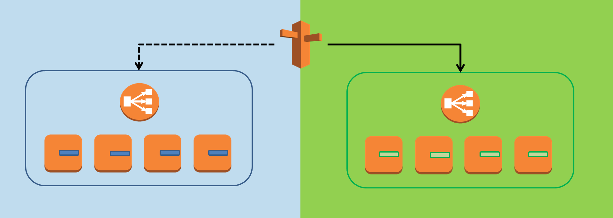

# Blue-Green deployment
This folder contains a ready to use example of a blue green deployment strategy

## How to ? 
Clone the repository:

    git clone git@github.com:GabrielWal/docker-utils.git
    cd blue-green-deployment

Simply run the build & deploy script:

    ./build-deploy.sh

Then open your favorite browser and check the following url (By default the blue stack is online)
>http://localhost:80

Then use the switch script:

    ./switch.sh

This will switch from current color blue to green.
The next time you call switch it will swith from green to blue.

In order to test the switch use the test-site script which will infinitely curl the color page of the sample app. This will show the impact of the switch.